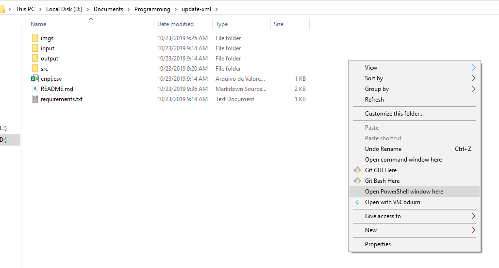

# Atualizar arquivos XML

## Descrição
Este projeto consiste em realizar algumas operações matemáticas em determinados arquivos XML que contenham determinado CNPJ no campo emitente, onde os CNPJ que serão verificados estão escritos no arquivo [CNPJ.csv](CNPJ.csv). Após isso, será gerado um relatório contendo informações sobre os arquivos XML que não foram alterados.

---
## Requisitos
* `Python - versão 3.7` - [Download](https://www.python.org/ftp/python/3.7.3/python-3.7.3-amd64.exe)
    * Para instalar o Python de forma correta, basta fazer o Download e na tela inicial, marcar o checkbox "Add Python 3.7 to PATH" e clicar em "Install Now"
    
* `pip (Gerenciador de pacotes do Python)` - o pip já será instalado ao realizar a instalação dessa forma.

---
## Dependências

**OBS: Para abrir uma janela de comando no diretório corrente, segure a tecla `Shift` e clique com o botão direito do mouse em algum ponto do espaço da pasta, após isso, clique na opção "Abrir janela de comando aqui"**

**Tanto o PowerShell quanto o Prompt de Comando, irão realizar as mesmas ações, portanto, a escolha do mesmo fica a critério do usuário.**

Para instalar as dependências, abra PowerShell/prompt de comando no diretório corrente e execute o comando abaixo:

* `python -m pip install -r requirements.txt --user`

---
## Como usar

Para executar o programa, abra um PowerShell/Prompt de Comando no diretório corrente e como parâmetro de execução do mesmo é preciso passar a pasta onde contém os arquivos XML ou um arquivo XML e também o arquivo onde contém os CNPJ que serão analisados.

* `cd src`
* **Comando para exibir ajuda**
    * `python main.py -h`
* **Executa o programa passando todos os arquivos XML que estão localizados na pasta `input`, onde serão analisados todos os CNPJ que foram escritos no arquivo `CNPJ.csv`.**:
    
    * `python main.py -f ..\input` 

    Caso nenhum parâmetro seja passado para o CNPJ, por padrão será carregado os CNPJs que estão escritos no arquivo CNPJ.csv na raiz pasta.

* **É possivel também, carregar outro arquivo diferente deste padrão para ler os CNPJs, desde que este esteja no formato .csv, basta usar o parametro --cnpj e inserir o caminho do arquivo**
    * `python main.py -f ..\input --cnpj ..\CNPJ.csv` 

* **Executa o programa passando somente um arquivo XML para ser analisado:**
    * `python main.py -f ..\input\35190912331433000109550010000399671725554367.xml` 

    * `python main.py -f ..\input\35190912331433000109550010000399671725554367.xml --cnpj ..\CNPJ.csv` 

A saída do programa será um relatório dos XMLs que não foram alterados, onde este será gravado na raiz da pasta e 
também os XMLs que foram atualizados, onde estes serão gravados na pasta `output`.

---